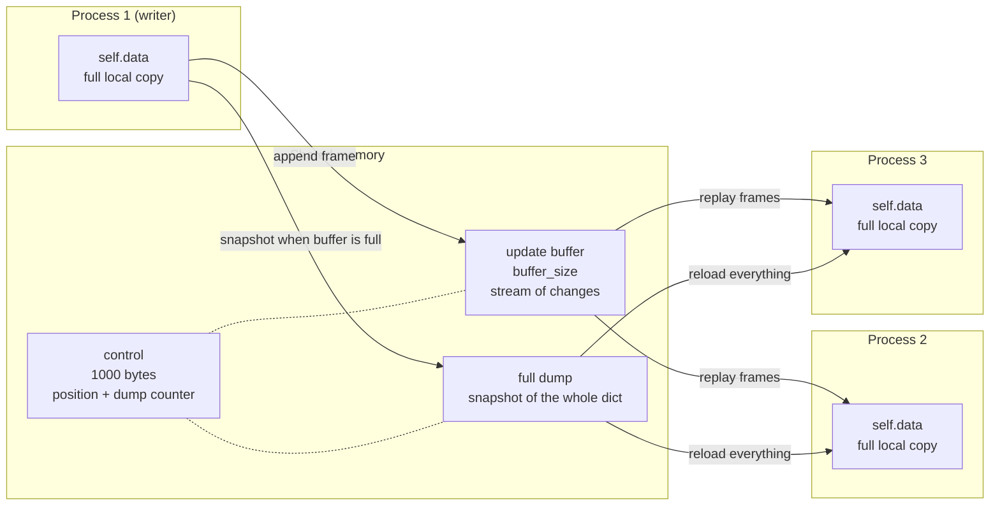
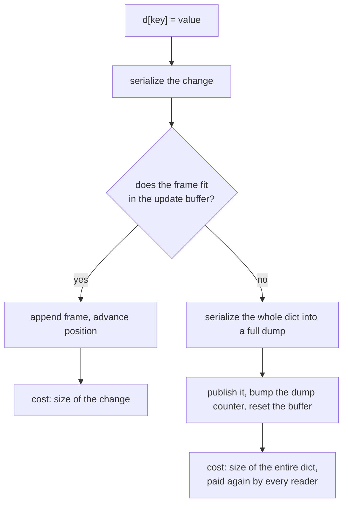
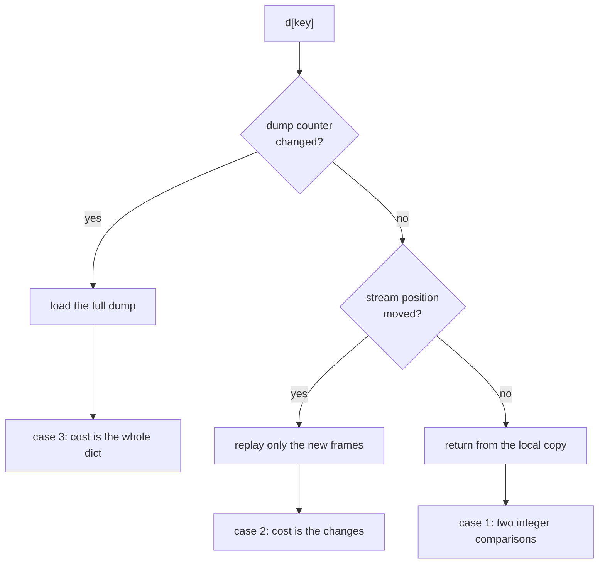

# UltraDict2

[](https://pypi.org/project/UltraDict2)
[](https://github.com/mvanderlee/UltraDict2/actions/workflows/test.yml)
[](https://www.python.org/downloads/)
[](https://github.com/mvanderlee/UltraDict2/blob/main/LICENSE)

Sychronized, streaming Python dictionary that uses shared memory as a backend

This is a maintained fork of [ronny-rentner/UltraDict](https://github.com/ronny-rentner/UltraDict),
published on PyPI as [`UltraDict2`](https://pypi.org/project/UltraDict2/).
Install with `pip install UltraDict2` and import with `from UltraDict2 import UltraDict`.

**Warning: This is an early hack. There are only few unit tests and so on. Maybe not stable!**

Features:
* Fast (compared to other sharing solutions)
* No running manager processes
* Works in spawn and fork context
* Safe locking between independent processes
* Tested with Python 3.11 - 3.14 on Linux, Windows and Mac
* Convenient, no setter or getters necessary
* Optional recursion for nested dicts

## Atomic operations via atomics2

Shared locking is built on [`atomics2`](https://github.com/mvanderlee/atomics2), a
maintained fork of the abandoned [atomics](https://github.com/doodspav/atomics)
package, rebuilt on patomic v1.1.0 with prebuilt wheels for Python 3.11 - 3.14
across Linux, Windows, and macOS (including arm64). It is installed automatically
as a dependency, so `shared_lock=True` works out of the box.

## General Concept

`UltraDict` uses [multiprocessing.shared_memory](https://docs.python.org/3/library/multiprocessing.shared_memory.html#module-multiprocessing.shared_memory) to synchronize a dict between multiple processes.

It does so by using a *stream of updates* in a shared memory buffer. This is efficient because only changes have to be serialized and transferred.

If the buffer is full, `UltraDict` will automatically do a full dump to a new shared
memory space, reset the streaming buffer and continue to stream further updates. All users
of the `UltraDict` will automatically load full dumps and continue using
streaming updates afterwards.

### What lives where

The dict itself is **not** stored in shared memory. Every process keeps its own complete
copy as an ordinary Python `dict`; shared memory carries the update stream and the
snapshots used to keep those copies in step.



Two consequences worth planning for:

- **Reads are local.** A read compares two integers in the control block and then hits the
  local `dict`. Nothing is deserialized unless something actually changed.
- **Memory scales with the number of processes.** A 500 MB dict shared by 8 processes costs
  roughly 8 x 500 MB of RAM plus the shared segments, not 500 MB. Shared memory here is a
  transport, not a way to store one copy.

### Writing



A write that does not fit is never streamed at all: it reaches other processes only inside
the snapshot. That is why `buffer_size` matters far more than it looks.

## Issues

On Windows, if no process has any handles on the shared memory, the OS will gc all of the shared memory making it inaccessible for
future processes. To work around this issue you can currently set `full_dump_size` which will cause the creator
of the dict to set a static full dump memory of the requested size. This full dump memory will live as long as the creator lives.
This approach has the downside that you need to plan ahead for your data size and if it does not fit into the full dump memory, it will break.

## Security

UltraDict uses `pickle` to serialize data by default. Unpickling attacker-controlled data leads to
arbitrary code execution, and any local process that can guess or enumerate the shared memory names
can write to the buffers. Only use UltraDict between processes that already trust each other and run
under user accounts you control; do not use it as a boundary against untrusted local processes. If
you need to share data with less trusted processes, pass a safe `serializer` (e.g. one based on JSON)
instead of pickle.

## Alternatives

There are many alternatives:

 * [multiprocessing.Manager](https://docs.python.org/3/library/multiprocessing.html#managers)
 * [shared-memory-dict](https://github.com/luizalabs/shared-memory-dict)
 * [mpdict](https://github.com/gatopeich/mpdict)
 * Redis
 * Memcached

## How to use?

### Simple

In one Python REPL:
```python
Python 3.11 on linux
>>>
>>> from UltraDict2 import UltraDict
>>> ultra = UltraDict({ 1:1 }, some_key='some_value')
>>> ultra
{1: 1, 'some_key': 'some_value'}
>>>
>>> # We need the shared memory name in the other process.
>>> ultra.name
'psm_ad73da69'
```

In another Python REPL:
```python
Python 3.11 on linux
>>>
>>> from UltraDict2 import UltraDict
>>> # Connect to the shared memory with the name above
>>> other = UltraDict(name='psm_ad73da69')
>>> other
{1: 1, 'some_key': 'some_value'}
>>> other[2] = 2
```

Back in the first Python REPL:
```python
>>> ultra[2]
2
```

### Nested

In one Python REPL:
```python
Python 3.11 on linux
>>>
>>> from UltraDict2 import UltraDict
>>> ultra = UltraDict(recurse=True)
>>> ultra['nested'] = { 'counter': 0 }
>>> type(ultra['nested'])
<class 'UltraDict2.UltraDict2.UltraDict'>
>>> ultra.name
'psm_0a2713e4'
```

In another Python REPL:
```python
Python 3.11 on linux
>>>
>>> from UltraDict2 import UltraDict
>>> other = UltraDict(name='psm_0a2713e4')
>>> other['nested']['counter'] += 1
```

Back in the first Python REPL:
```python
>>> ultra['nested']['counter']
1
```

## Performance comparison

Lets compare a classical Python dict, UltraDict, multiprocessing.Manager and Redis.

<picture>
  <source media="(prefers-color-scheme: dark)" srcset="docs/performance-dark.png">
  
</picture>

Median across Python 3.11 - 3.14 on Debian 12 bare metal, 10,000 keys:

| | read | vs dict | write | vs dict |
| --- | ---: | ---: | ---: | ---: |
| `dict` | 11 ns | 1x | 13 ns | 1x |
| `ultra.data` (direct) | 12 ns | 1x | — | — |
| **`UltraDict`** | **223 ns** | **21x** | **1.87 µs** | **145x** |
| `Manager` dict | 9.16 µs | 872x | 9.21 µs | 716x |
| Redis, loopback | 24.93 µs | 2,373x | 27.22 µs | 2,117x |
| Redis, 1GbE LAN hop | 206.8 µs | 19,698x | 218.5 µs | 16,962x |

Reading through UltraDict costs about **21x a plain dict**, and is **41x faster than a
`Manager` dict** and **112x faster than a local Redis**. Against a Redis on another machine,
which is the more usual deployment, it is roughly **1000x** faster. Reading `ultra.data`
directly is within ~10% of a plain dict, at the cost of not seeing updates.

The gap in the middle of the chart is the point: there is nothing between reading local
memory and crossing a socket. A read that finds nothing new never leaves the process, which
is what buys the two orders of magnitude.

Writes cost more than reads because the change is serialized and published, and because a
write that does not fit the buffer forces a full dump of the whole dict. See
[Buffer sizes and read performance](#memory-management) for how to size it.

### Python version

Across 3.11 - 3.14 everything lands within 1.1 - 1.4x, which is close enough to call flat:

| read | 3.11 | 3.12 | 3.13 | 3.14 |
| --- | ---: | ---: | ---: | ---: |
| `dict` | 9 ns | 11 ns | 11 ns | 9 ns |
| `UltraDict` | 202 ns | 223 ns | 223 ns | 201 ns |
| `Manager` dict | 7.26 µs | 8.20 µs | 9.16 µs | 9.57 µs |
| Redis | 24.08 µs | 24.81 µs | 25.02 µs | 24.93 µs |

3.11 and 3.14 are marginally the quickest for UltraDict, but not by enough to pick a version
over.

One caveat that cost us a wrong conclusion, recorded here so nobody repeats it: the same
benchmark inside a **virtual machine** reported UltraDict as 2.1x slower on 3.13 than on
3.11, reproducibly. On bare metal that gap is 1.1x. Virtualized IPC and memory access
inflate this workload unevenly across versions, so benchmark UltraDict on the kind of
machine you will actually deploy on.

### Method

Debian 12 bare metal, 12 cores, each Python version in its official Docker image, Redis 7 on
the same host over loopback, 10,000 keys, best of three timing repeats. Every candidate gets
its own iteration count and results are reported per operation, so a 11 ns operation and a
25 µs one are directly comparable. The LAN row was measured from a second machine on a 1GbE network, where the four
Python versions agree to within 1.02x because the wire dominates.

This is not a real life workload and it is single process: it measures the cost of the
operations, not what happens when several processes contend.

Reproduce it with `tests/performance/compare.py`. There is also a throughput test in
`tests/performance/performance.py`, and `tests/performance/buffer_size_sweep.py` for
choosing `buffer_size`.

I am interested in extending the performance testing to other solutions (like sqlite, memcached, etc.) and to more complex use cases with multiple processes working in parallel.

## Parameters

`Ultradict(*arg, name=None, create=None, buffer_size=10000, serializer=pickle, shared_lock=False, full_dump_size=None, auto_unlink=None, recurse=False, recurse_register=None, **kwargs)`

`name`: Name of the shared memory. A random name will be chosen if not set. By default, if a name is given
a new shared memory space is created if it does not exist yet. Otherwise the existing shared
memory space is attached.

`create`: Can be either `True` or `False` or `None`. If set to `True`, a new UltraDict will be created
and an exception is thrown if one exists already with the given name. If kept at the default value `None`,
either a new UltraDict will be created if the name is not taken or an existing UltraDict will be attached.

Setting `create=True` does ensure not accidentally attaching to an existing UltraDict that might be left over.

`buffer_size`: Size of the shared memory buffer used for streaming changes of the dict.
The buffer size limits the biggest change that can be streamed, so when you use large values or
deeply nested dicts you might need a bigger buffer. Otherwise, if the buffer is too small,
it will fall back to a full dump. Creating full dumps can be slow, depending on the size of your dict.

Whenever the buffer is full, a full dump will be created. A new shared memory is allocated just
big enough for the full dump. Afterwards the streaming buffer is reset.  All other users of the
dict will automatically load the full dump and continue streaming updates.

(Also see the section [Memory management](#memory-management) below!)

`serializer`: Use a different serialized from the default pickle, e. g. marshal, dill, jsons.
The module or object provided must support the methods *loads()* and *dumps()*

`shared_lock`: When writing to the same dict at the same time from multiple, independent processes,
they need a shared lock to synchronize and not overwrite each other's changes. Shared locks are slow.
They rely on the [atomics2](https://github.com/mvanderlee/atomics2) package for atomic locks. By default,
UltraDict will use a multiprocessing.RLock() instead which works well in fork context and is much faster.

(Also see the section [Locking](#locking) below!)

`full_dump_size`: If set, uses a static full dump memory instead of dynamically creating it. This
might be necessary on Windows depending on your write behaviour. On Windows, the full dump memory goes
away if the process goes away that had created the full dump. Thus you must plan ahead which processes might
be writing to the dict and therefore creating full dumps.

`auto_unlink`: If True, the creator of the shared memory will automatically unlink the handle at exit so
it is not visible or accessible to new processes. All existing, still connected processes can continue to use the
dict.

`recurse`: If True, any nested dict objects will be automaticall wrapped in an `UltraDict` allowing transparent nested updates.

`recurse_register`: Has to be either the `name` of an UltraDict or an UltraDict instance itself. Will be used internally to keep track of dynamically created, recursive UltraDicts for proper cleanup when using `recurse=True`. Usually does not have to be set by the user.

## Memory management

`UltraDict` uses shared memory buffers and those usually live is RAM. `UltraDict` does not use any management processes to keep track of buffers.  Also it cannot know when to free those shared memory buffers again because you might want the buffers to outlive the process that has created them.

By convention you should set the parameter `auto_unlink` to True for exactly one of the processes that is using the `UltraDict`. The first process
that is creating a certain `UltraDict` will automatically get the flag `auto_unlink=True` unless you explicitly set it to `False`.
When this process with the `auto_unlink=True` flag ends, it will try to unlink (free) all shared memory buffers.

A special case is the recursive mode using `recurse=True` parameter. This mode will use an additional internal `UltraDict` to keep
track of recursively nested `UltraDict` instances. All child `UltraDicts` will write to this register the names of the shared memory buffers
they are creating. This allows the buffers to outlive the processes and still being correctly cleanup up by at the end of the program.

**Buffer sizes and read performance:**

There are 3 cases that can occur when you read from an `UltraDict:

1. No new updates: This is the fastes cases. `UltraDict` was optimized for this case to find out as quickly as possible if there are no updates on the stream and then just return the desired data. If you want even better read perforamance you can directly access the underlying `data` attribute of your `UltraDict`, though at the cost of not getting real time updates anymore.

2. Streaming update: This is usually fast, depending on the size and amount of that data that was changed but not depending on the size of the whole `UltraDict`. Only the data that was actually changed has to be unserialized.

3. Full dump load: This can be slow, depending on the total size of your data. If your `UltraDict` is big it might take long to unserialize it.



Note that synchronization is pull based and lazy: there is no background thread. A process
only catches up when it touches the dict, so an idle process pays for everything it missed
on its next access.

Given the above 3 cases, you need to balance the size of your data and your write patterns with the streaming `buffer_size` of your UltraDict. If the streaming buffer is full, a full dump has to be created. Thus, if your full dumps are expensive due to their size, try to find a good `buffer_size` to avoid creating too many full dumps.

On the other hand, if for example you only change back and forth the value of one single key in your `UltraDict`, it might be useless to process a stream of all these back and forth changes. It might be much more efficient to simply do one full dump which might be very small because it only contains one key.

## Locking

Every UltraDict instance has a `lock` attribute which is either a [multiprocessing.RLock](https://docs.python.org/3/library/multiprocessing.html#multiprocessing.RLock) or an `UltraDict.SharedLock` if you set `shared_lock=True` when creating the UltraDict.

RLock is the fastest locking method that is used by default but you can only use it if you fork your child processes. Forking is the default on Linux systems.

In contrast, on Windows systems, forking is not available and Python will automatically use the spawn method when creating child processes. You should then use the parameter `shared_lock=True` when using UltraDict. This uses the [atomics2](https://github.com/mvanderlee/atomics2) package, which is installed automatically as a dependency.

### How to use the locking?
```python
ultra = UltraDict(shared_lock=True)

with ultra.lock:
	ultra['counter']++

# The same as above with all default parameters
with ultra.lock(timeout=None, block=True, steal=False, sleep_time=0.000001):
	ultra['counter']++

# Busy wait, will result in 99 % CPU usage, fastest option
# Ideally number of processes using the UltraDict should be < number of CPUs
with ultra.lock(sleep_time=0):
	ultra['counter']++

try:
	result = ultra.lock.acquire(block=False)
	ultra.lock.release()
except UltraDict.Exceptions.CannotAcquireLock as e:
	print(f'Process with PID {e.blocking_pid} is holding the lock')

try:
	with ultra.lock(timeout=1.5):
		ultra['counter']++
except UltraDict.Exceptions.CannotAcquireLockTimeout:
	print('Stale lock?')

with ultra.lock(timeout=1.5, steal_after_timeout=True):
	ultra['counter']++

```

## Explicit cleanup

Sometimes, when your program crashes, no cleanup happens and you might have a corrupted shared memeory buffer that only goes away if you manually delete it.

On Linux/Unix systems, those buffers usually live in a memory based filesystem in the folder `/dev/shm`. You can simply delete the files there.

Another way to do this in code is like this:
```python
# Unlink both shared memory buffers possibly used by UltraDict
name = 'my-dict-name'
UltraDict.unlink_by_name(name, ignore_errors=True)
UltraDict.unlink_by_name(f'{name}_memory', ignore_errors=True)
```

## Advanced usage

See [examples](/examples) folder

```python
>>> ultra = UltraDict({ 'init': 'some initial data' }, name='my-name', buffer_size=100_000)
>>> # Let's use a value with 100k bytes length.
>>> # This will not fit into our 100k bytes buffer due to the serialization overhead.
>>> ultra[0] = ' ' * 100_000
>>> ultra.print_status()
{'buffer': SharedMemory('my-name_memory', size=100000),
 'buffer_size': 100000,
 'control': SharedMemory('my-name', size=1000),
 'full_dump_counter': 1,
 'full_dump_counter_remote': 1,
 'full_dump_memory': SharedMemory('psm_765691cd', size=100057),
 'full_dump_memory_name_remote': 'psm_765691cd',
 'full_dump_size': None,
 'full_dump_static_size_remote': <memory at 0x7fcbf5ca6580>,
 'lock': <RLock(None, 0)>,
 'lock_pid_remote': 0,
 'lock_remote': 0,
 'name': 'my-name',
 'recurse': False,
 'recurse_remote': <memory at 0x7fcbf5ca6700>,
 'serializer': <module 'pickle' from '/usr/lib/python3.11/pickle.py'>,
 'shared_lock_remote': <memory at 0x7fcbf5ca6640>,
 'update_stream_position': 0,
 'update_stream_position_remote': 0}
```

Note: All status keys ending with `_remote` are stored in the control shared memory space and shared across processes.

Other things you can do:
```python
>>> # Create a full dump
>>> ultra.dump()

>>> # Load latest full dump if one is available
>>> ultra.load()

>>> # Show statistics
>>> ultra.print_status()

>>> # Force load of latest full dump, even if we had already processed it.
>>> # There might also be streaming updates available after loading the full dump.
>>> ultra.load(force=True)

>>> # Apply full dump and stream updates to
>>> # underlying local dict, this is automatically
>>> # called by accessing the UltraDict in any usual way,
>>> # but can be useful to call after a forced load.
>>> ultra.apply_update()

>>> # Access underlying local dict directly for maximum performance
>>> ultra.data

>>> # Use any serializer you like, given it supports the loads() and dumps() methods
>>> import jsons
>>> ultra = UltraDict(serializer=jsons)

>>> # Close connection to shared memory; will return the data as a dict
>>> ultra.close()

>>> # Unlink all shared memory, it will not be visible to new processes afterwards
>>> ultra.unlink()

```

## Metrics

`get_metrics()` returns a plain dataclass of scalars, so you can feed a monitoring system
without UltraDict pulling in a monitoring dependency.

```python
>>> ultra = UltraDict()
>>> ultra['some key'] = 'some value'
>>> ultra.get_metrics()
Metrics(item_count=1, item_size_bytes_min=39, item_size_bytes_max=39, item_size_bytes_sum=39,
        item_size_observations_total=1, buffer_size_bytes=10000, buffer_used_bytes=45,
        buffer_used_fraction=0.0045, full_dump_size_bytes=None, full_dump_last_bytes=None,
        full_dump_total=0, buffer_full_forced_dump_total=0, full_dump_memory_full_total=0,
        full_dump_too_fast_total=0, shm_total_bytes=67108864, shm_used_bytes=1052672,
        shm_free_bytes=66056192)
```

The item size fields describe the *serialized size of the writes this instance has made*,
not a measurement of the current contents. Measuring the latter would mean re-serializing
every key on every call. The mean is `item_size_bytes_sum / item_size_observations_total`.

The `shm_*` fields report the whole `/dev/shm` filesystem, shared by every process on the
machine. They are `None` on platforms without `/dev/shm`, such as Windows and macOS.

Counters are per instance, are never shared through the control memory, and reset when the
process restarts. `get_metrics()` takes no lock, so a value can be one write stale.

### Exporting to Prometheus

Register a collector that scrapes on demand:

```python
from prometheus_client.core import CounterMetricFamily, GaugeMetricFamily, REGISTRY

class UltraDictCollector:
    def __init__(self, ultra):
        self.ultra = ultra

    def collect(self):
        metrics = self.ultra.get_metrics()
        labels  = [self.ultra.name]

        gauge = GaugeMetricFamily('ultradict_items', 'Items in the dict', labels=['name'])
        gauge.add_metric(labels, metrics.item_count)
        yield gauge

        gauge = GaugeMetricFamily('ultradict_buffer_used_fraction', 'Update buffer fill level', labels=['name'])
        gauge.add_metric(labels, metrics.buffer_used_fraction)
        yield gauge

        counter = CounterMetricFamily('ultradict_buffer_full_forced_dumps', 'Full dumps caused by a full buffer', labels=['name'])
        counter.add_metric(labels, metrics.buffer_full_forced_dump_total)
        yield counter

REGISTRY.register(UltraDictCollector(ultra))
```

What to watch:

| Metric | Meaning |
| ------ | ------- |
| `buffer_full_forced_dump_total` rising | `buffer_size` is too small for your write rate. Every event is a full dump of the whole dict. |
| `full_dump_memory_full_total` > 0 | The dict outgrew a static `full_dump_size`. Writes are failing. |
| `full_dump_too_fast_total` rising | Readers cannot keep up with the dump rate and are reloading. |
| `shm_free_bytes` falling | The machine is running out of shared memory, possibly because of leaked segments. |

## Contributing

Contributions are always welcome!
